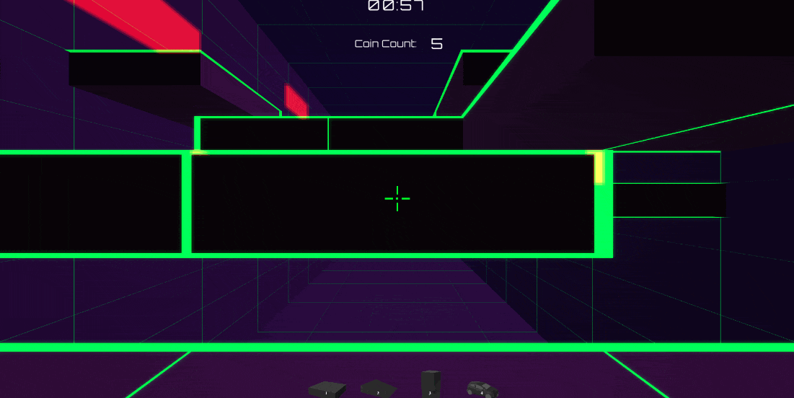

**The University of Melbourne**
# COMP30019 – Graphics and Interaction
## Teamwork plan/summary
<!-- [[StartTeamworkPlan]] PLEASE LEAVE THIS LINE UNTOUCHED -->
<!-- Fill this section by Milestone 1 (see specification for details) -->
### Protocols and Plans
* Sprints will be held weekly, with the first starting on the 16th of September.
* Team :ok_hand: will be using GitHub's issues to create tickets for features, bugs, and other content required for this project.
* Tasks are to be delegated during the weekly meetings being held on Fridays, 4:00PM to 5:00PM.
* The previous week's work should be completed by the time the sprint is done (the following Friday), any bugs/blockers withstanding.
* Every feature should be developed in their own branch, with pull requests requiring reviews and approval from fellow team members.

Team communication is done via the team's discord server.

### Team Member Responsibilities

After brainstorming the most important aspects to start off our game, we have settled on two major categories which can be further broken down: Feels Good and Plays Good.

Feels Good is broken down into UI/UX, Custom Shaders, and Gameplay Mechanics/Ideas.

Plays Good is broken down into Character Movement and Level Generation.

Unassigned work is to be delegated and/or expanded upon every sprint. Each team member can help the other, but the work defined in the two categories are the team member's main responsibility.

**Benjamin Yi - Plays Good**

**Issues Worked On:** #1, #13, #14, #16, #22, #36, #54, #58, #59, #63, #70, #71
* Object placement and controls
* Endless mode and procedural generation
* Character movement fine-tuning
* Fog of war shader with Sean

**Elizabeth Wong - Plays Good**

**Issues Worked On:** #4, #5, #12, #23, #28, #53, #62, #64, #69
* Character movement
* Advanced character movement: wall jump + wall slide
* Character camera and fine-tuning
* Timer and additional timer features
* Cel Shader with Caitlin

**Caitlin Grant - Feels Good**

**Issues Worked On:** #3, #6, #7, #12, #15, #33, #37, #38, #66, #67, #68
* UI - Main Menu, Sub Menus, Pause Menu, etc.
* Implement background music
* Implement kill box
* Editing of gameplay video (footage coming from team members)
* Cel Shader with Liz and integration of the fog of war shader
* Bloom and Glow shader

**Sean Maher - Feels Good**

**Issues Worked On:** #2, #13, #17, #19, #21, #32, #34, #35, #41, #58, #72, #73
* Level Generation
* Level design for levels 1, 2, and 3
* Design of different blocks that appears in the levels (ice. mud, spikes)
* Helped with implementation of the kill box and linking of levels to the main menu
* Fog of war shader with Ben
* Implementation of particle effects for the Goal object

**Group Efforts**
A lot of collaboration has been done between the team members, with the use of VsCode's Live Share being integral to the development of the game. The entire team participated in how the game should look before recording the scenes used for the gameplay video and each member also participated in recruiting people to test out the game.

<!-- [[EndTeamworkPlan]] PLEASE LEAVE THIS LINE UNTOUCHED -->
## Final report
### Game Summary

_Super Hop_ is an exciting first-person 3D strategic running game. The aim of this game is to survive each timed level by making it to a goal point at the end of each map. In a race against time, you must use your allocated amount of blocks wisely to pave a path towards the end goal, whilst collecting coins to continue forging your way forwards and keep your timer from ticking to zero. Hop your way to victory with complex movement mechanics such as wall sliding and wall jumping! But beware, not all tiles you step on are as equal as others - one wrong block could send you plummeting to death. Currently playable in two modes: levelled and endless.

---
### Table of contents
* [Game Summary](#game-summary)
* [Technologies](#technologies)
* [How To Play](#how-to-play)
* [Gameplay Design](#gameplay-design)
	* [Design Decisions](#design-decisions)
	* [Procedural Generation](#procedural-generation)
* [Graphics](#graphics)
	* [Shader #1](#cel-shader)
	* [Shader #2](#glow-shader)
	* [Particle Effects](#particle-effects)
* [Evaluation and Feedback](#evaluation-and-feedback)
* [References/External Sources](#references-and-external-sources)
---
### Technologies

Project is created with:

* Unity 2022.1.9f1

### How To Play
There are two aims of this game as there are two modes. The levelled mode - levels 1 to 3 - serve as both instructive and playable levels where the goal is to safely get to the other side within the time limit by building blocks and jumping. In regards to movement mechanics there are two distinct features which enhance the player experience: wall jumping and wall-sliding.

On the other hand, the goal of endless mode is to simply stay alive for as long as possible while travelling forwards until the timer (located at the top of the screen) ends. Coins in both modes act as a currency to place blocks where 1 coin gives players the ability to place 1 block. Once the amount of coins stashed has been exhausted, the player will no longer be able to place blocks and more coins will need to be collected in order to continue using the build ability. Additionally, coins are not a valuable resource for players to exchange for building blocks, but also add 5 seconds of time per coin collected to your ticking timer.

In regards to ‘losing’ within a level, there are two ways where a player can fail to complete the game: falling off a platform and the timer reaching zero. Within levelled mode, a player has infinitely many attempts within that level to respawn and attempt to win before the timer ends. Conversely during endless mode, there is no way to ‘win’ as there is no goal state, however a player’s score will be calculated and displayed once a player dies within endless mode.

---
### Gameplay Design
#### Design Decisions
**Timer for Urgency:**
The timer acts as a medium to add a sense of urgency within players, prompting them to complete each level within a timeframe or lose. The usage of coins in conjunction with the timer adds a greater level of depth as players are incentivized to go out of their way to reach coins not only for building but especially within Endless mode, to gather coins for more time. There was an active decision to make the timer and coin relationship unstackable. In simple terms if the timer’s starting time is 2:00, it will never exceed its starting time even if a player collects many coins. I.e the timer could be at 1:57 and if a player collects a coin and adds 5 seconds to their in-game timer, it will never exceed the starting time of 2:00. This makes the game more challenging and exciting for the player.

**Coyote Time:**
There is a brief period of time where if a player lands on the side of a platform, they are given an opportunity to attempt a jump to ‘save themselves’ before sliding to their death. This allows a chance for players to rectify any movement mistakes acting as a second chance.

**Aerial movement mechanics:**
In order to elevate the gameplay, wall jumping and sliding features were added to enable a “feels good” movement element to the game. This was done by ray-casting from the player to a Wall mask and allowing a jump state to be processed when in a Wall Jumping/ Wall Sliding condition. Whilst in the air the player is also given the opportunity to align the character in the air but giving directional input in order for more freedom of movement.

**Level Design:**
Levels 1, 2 and 3 were designed according to the capabilities of player movement. The spacing of the platforms in each level are reachable by the player, sometimes intentionally requiring the player to build. Additionally, some blocks are placed to make the movement awkward for the player, increasing difficulty and also further encouraging the player to place blocks to reduce the time to finish the level. Level 1, 2 and 3 act as a tutorial to show the player what they are capable of within Super Hop to prepare them for endless mode.

**Different Material Platforms (Ice and Mud):**
In addition to the classic platforms, two unique platform materials were created both on a visual and physical scale. The Ice platform appears to players as a platform surrounded by an arctic blue rim and glow. As suggested by its name, it affects movement whilst a player is in contact with its surface, making any movement on this platform more ‘slippery’ - like ice. On the contrary, the Mud platform visually holds a brown outline and glow whilst affecting a player by slowing down player movement once in contact.

These two different platform blocks add variability within the gameplay both mechanically and visually, both challenging a player’s grasp of the game’s movement and adding to the games “vaporwave” aesthetic. Furthermore, this gameplay design decision forces players to stay engaged within each level by paying attention to variations within platforms and their effect on player movement.
  

#### Procedural Generation
Procedural generation is used to create endless mode by generating random platforms, obstacles, and coins. The endless mode level is generated 20 platform lengths at a time, hiding unloaded sections behind an opaque wall and loading it when the player reaches 200 units within the wall, unloading the wall in the process.

To generate a section of the endless level, a Perlin noise generator is queried at regular intervals to create a continuous terrain of platforms. Then platforms are randomly deleted to create a corridor of spare platforms. This results in what appears to be random placements of platforms, but with close platforms at similar heights. The advantage of this over completely randomly placed platforms is it prevents close platforms having large vertical distances, which is difficult and frustrating in gameplay, while still allowing platforms far apart to be vertically separated - leading to emergent challenging gameplay that still feels fair and predictable.

Secondly, the platforms are mutated into ice and mud blocks according to a separate, 1D Perlin noise generator. This Perlin noise generator is queried along the depth of the level, and transforms the platforms into ice and mud blocks depending on what range the Perlin noise generator returns. For example, platforms are transformed into ice blocks if a value between 0.0 and 0.3 is generated. The advantage of this over random transformations is that “biomes” of ice and mud can be found naturally in the endless mode, where the player will alternate between sections of differing environments. This avoids having single blocks of ice and mud interspersed with each other, which not only provides little game play value, but also does not fit with the game’s visual themes.

Finally, spikes and coins are added at random. The starting area is guaranteed to be a safe zone to begin in, and checkpoints areas consisting of safe platforms appear at fixed intervals to give a sense of progression to the player.

The four major steps (full terrain, deleting platforms, mutating environment, adding coins) are shown in the following image:

<p align="center">
  
</p>

---
### Graphics
To preface all the assets used, the original idea for Super Hop involved a simple, clean look. This was furthered when choosing the perspective the player would be in. The decision of using first-person perspective made several sources of inspiration apparent - the VR game Beat Saber and movies such as Tron and Blade Runner with their synthwave, outrun aesthetic synergized well with our goals.

<p align="center">
  
</p>

Very little assets are taken from the assets store in Unity such as the ramp, column, and car which can be placed down. We had created the spikes in Blender for the spike trap prefab due to the lack of a cone object in Unity. Most of the objects used come from Unity out of the box.

When discussing if we should use more assets from the unity store, we concluded that the emphasis should be on the shader applied to the object, and that it would not be productive to look for premade assets which fit the aesthetic we are hoping to achieve. The decisions made are the results of tradeoffs and balances, such as the amount of attention provided to a limited set of models as opposed to quickly working on a large variety.

Given the way levels are generated in Super Hop, all of the rendered objects in a level, with the exception of the player, are generated from prefabs. This can introduce extra costs by considering the way shaders are used in Unity (attached to materials) and how the same object is required to be duplicated for variance in design. Despite this repetition, distinguishable entities are created with the custom shaders through the use of colour.

When considering on what sort of shader(s) we would implement, we looked at the key characteristics of both the synth-wave and outrun art style.

The characteristics we focused on are as such:

*  80s-centric
* Sunset graphics
* Neon grids
* Neon lights
* Wireframe vector graphics
* Retro-futurism

This led us to the creation of the following custom shaders: cel shader, bloom shader, and glow shader. 
These can be found in `./Assets/Shaders` and out of the three, the _cel shader_ and the _glow shader_ are the two which are to be evaluated.

These shaders enhance the visuals of the game by being the visuals, working in conjunction with one another. Without the effects provided in these shaders, we would not be able to achieve the characteristics which are iconic to the inspirations we draw from. Furthermore, cel shading aids our goal of clean and simple. Cel shading typically does not utilize textures, and textures can add a layer of visual information which can overload the player. Regarding the glow and bloom effect, the glow enhances the neon colours, whereas the bloom helps intensify the brightness of the rendered frame.

Super Hop uses Unity’s Built-in Render Pipeline with the forward rendering path. The main focus of these custom shaders is in regard to the drawing and post-processing operations.

#### Cel Shader
```
-Shader
./Assets/Shaders/CelShader.shader

Shader file to be evaluated: ./Assets/Shaders/CelShader.shader
```

Occurring during the drawing process, the cel shader provides a variety of effects made in three passes.

  

These effects are:
* Object Outline
* Diffuse and Specular Light (including posterization)
* Fog
* Inner Glow

In the first pass, all the effects besides the object outline is applied. The steps can be simplified as such:

1.  Diffuse Lighting
2.  Specular Lighting
3.  Inner Glow
4.  Composite the results of 1 to 3.
5.  Apply fog (based on the distance from the player to the object)

In the second pass the object outline is created with the fog also being calculated to ensure the outline does not stand out in the fog. This pass has limitations as the outline can affect other objects, which may produce some visual bugs for the player.

In the third pass the shadow of the object is cast to the scene.

#### Glow Shader
```
– Shader
./Assets/Shaders/CameraGlowShader.shader
→ Used on the camera with GlowPostProcess and GlowCameraMat.mat
./Assets/Shaders/CmdDepthShader.shader
→ Used with GlowObj.cs and GlowObjMat.mat

– Scripts
./Assets/Shaders/GlowObj.cs
./Assets/Shaders/GlowPostProcess.cs
./Assets/Shaders/GlowRender.cs

– Materials
./Assets/Shaders/GlowCameraMat.mat
./Assets/Shaders/GlowObjMat.mat

Shader file to be evaluated: ./Assets/Shaders/CameraGlowShader.shader
```

  

This glow is a post-processing effect that works in two stages of the rendering journey. Firstly, a command buffer is made to run the `CmdDepthShader` before image effects are applied. Chosen objects in the scene have the `GlowObj` script attached to them and are then added into the set of Glow Objects in `GlowRender`. From the `GlowRender` script the selected object is drawn onto a black Render Texture (RT) in the chosen glow colour. This process involves creating a depth map to see if there is something blocking the object. If so, then the parts which are hidden are not drawn to the RT.

Once the RT is completed, the second stage of the process begins. The RT from the first stage becomes a global texture to be accessed in `GlowPostProcess`. This script which is attached to the camera then grabs a copy of the scene before glow is applied, then downsamples and upsamples the newly made global texture with a box blur. That RT is then applied to the copy of the final scene and blitted into the destination RT, which is what is displayed on the player’s screen.

Further improvements which could be made on this effect is the way the blur is handled, as well as allowing more customization for the colour and strength of the glow.

It should be noted that the bloom effect acts in a similar way to the glow effect. The bloom shader downsamples, upsamples, and uses a box blur. The key difference between the two is that the bloom shader acts on the entire scene and only makes changes to the pixel based on if the red colour value is above a certain threshold.

#### Particle Effects
The particle system implemented in Super Hop emits particles from the goal object which the player aims to collect in order to complete a level. The particle system can be located in the `./Assets/Assets - level` directory and is contained in the `GoalParticles` prefab under the name `Orbs`. The purpose of the particle system is to increase the appeal of reaching the goal, and also helps differentiate the goal objects from other objects such as coins.

The main attributes of the particle system that were incorporated were Emission, Shape, Velocity over Lifetime, Colour over Lifetime, Size over Lifetime, Noise, and Trails.

The lifetime of the particles is set to a random value between 1 and 4. This makes the particles seem less uniform and more random as some will be visible longer, while others will disperse quickly. The particles vary in velocity, size and colour over the span of this lifetime. This gives the effect of the particles losing energy and fizzling out after being emitted from the goal object. The colour over lifetime in particular provides a smoother appearance and disappearance of particles making it more visually appealing.

The noise attribute is used to provide a sense of randomness to the path of emitted particles. The strength and frequency values within the noise attribute were adjusted with trial and error to achieve a visually appealing speed and amount of direction change displayed by the particles. The aim was to create an electric field like effect around the goal object.

Trails were added to the particles to not only make the particles more visible, but also to help enhance the effect the noise provides by displaying the path of the particles which also helps to contribute to an electric field like effect around the goal. The trail has the same colour over lifetime effect as the particles.

A sphere was chosen as the shape of the emitter. This is in accordance with the shape of the goal object. 

The amount of particles emitted per second was chosen with trial and error. The value chosen was 70, this was keeping in mind that too many particles can not only be distracting to the player, but also more expensive to render, and could cause FPS drops. Too few particles, and the effect of the particle system is too underwhelming and doesn’t achieve its purpose of drawing the players attention.

### Evaluation and Feedback

#### 1. Demographics
In total there were 11 participants that tested Super Hop. Information about Player Demographics were collected through the Player Demographic section of the Google Form Questionnaire. A brief overview about the user statistics showed that:

Most of the participants were male (81.8%), with the majority of users being between 21-26 years of age (63.7%). It was also noted that most users (45.5%) invested more than 20+ hours per week on games whilst 100% of participants selected PC as the primary platform of gaming. 

Regarding primarily played game genres there were many variations, however it was distinct that RPG (63.6%), MOBA (72.7%) , MMORPG (63.6%)  and FPS (63.6%)  were the core genres of experience within testers - with the Platforming genre deprioritized (27.3%). Information regarding a participant’s presumed overall gaming skill level was also highlighted in order to be contrasted towards their presumed confidence level concerning platform games.  54.5% of users rated their overall gaming abilities extremely highly, however when asked to rate their skills in platformers, majority (63.7%)  filled in responses close to not confident or neutral. 

#### 2. Methodology
There was a set workflow employed by each team member in regards to user testing. This involved getting participants to watch the Super Hop trailer as a preliminary step. Next, the game was provided via a zip file on GoogleDrive where various observational methods (see 2.2) were employed whilst the user plays the game. Whilst the participant is playing and giving feedback, each team member is expected to record this data either textually or through a screen capture/ video recording. As the participant concludes their play test of Super Hop, they are queried on their experience through a GoogleForm Questionnaire. If there are any circumstances under a team member’s discretion where more information is needed about a certain area of critique from a user, a supplementary interview can be held to gain a more detailed insight if needed. 

#### 2.1 Querying Methods
The main form of querying used was a post-study questionnaire in the form of a Google Form for easy analysis and collating of data. Within the questionnaire the team decided to have 4 different sections of analysis: 

* Player Demographic
* Game Impressions
* Game Visuals
* Game Mechanics 

Within each section of the questionnaire, a mix of both closed and open questions were created. Closed questions mainly consisted of providing an answer based on a given scale of 1-5, with 1 being low and 5 being high. By providing closed questions answering in a scale format, this allowed simpler and faster analysis as well as adding more detail to the feedback given compared to a ‘yes/no’ answer format.

In regards to creating open ended questions, team members attempted to avoid asking long and leading questions. Compound questions were also avoided by splitting each section of analysis into different parts to avoid multi-part questions and answers. 

Additionally, after receiving feedback from participants, interviews were held by some team members without fixed questions concerning areas of feedback that needed more verbal detail and querying. 

#### 2.2 Observation Methods
The primary observational method used within garnering participant feedback was an interactive variation of the “think aloud” technique. This involved urging a participant to stream their gameplay for scrutiny as well as encouraging and interacting with them whilst playing the game. Whilst this method was more time consuming for both team members and participants, it allowed for a more relaxed experience for the user - pushing them to actively critique the game during the whole experience to gather in-the-moment feedback. 

A cooperative evaluation approach was also taken for a few participants for variation of observation methods where the user was left to test the game uninterrupted and only queried by a team member about specific aspects after they have finished. This ensures that the testing is more rigorous as a team member is unable to potentially make the mistake of ‘over-helping’. However it didn’t seem like the best approach to take in this case as some participants tended to forget their in-the-moment interpretations from their initial ad-hoc interpretations. 

In regards to capturing user observations, most team members opted to textually record user feedback whilst some screen captured and recorded their testing sessions with participants.

#### 3. Feedback Received
There were a range of responses that varied within the feedback received by participants. After analysis of such information it was finalised that the main aspects of criticism lay within these areas concerning Game Mechanics:
* Air movement was too strong: there is too much force that a user is able to apply to their character whilst in the air
* A need for Coyote time: when players land on the side/edge of a platform they are stuck
* Indefinite wall jumping: users are able to indefinitely wall jump across each level without properly playing. This breaks the intent of the game.
* Camera sensitivity too high
* No restart button for endless mode: it is tedious to replay the game from main menu options each time after losing in endless mode
* Endless mode white box bug: there is a random white box/ hole in the wall within endless mode 
* Death box broken in Endless mode: the death box does not work all the time 
* Levels were too long/ not enough time to complete each level
* Default volume too loud 
* Issues with text being broken at times

Thus these areas became the basis of fixes and features applied within the final sprint. 

Concerning Game Impressions there was a spread of responses concerning how challenging Super Hop was for each user. It is noted that 36.4% viewed Super Hop as ‘not that challenging’ whilst 27.3% saw the game as “quite challenging”. This result may be correlated towards the demographic of participants sampled where the majority (54.5%) rated their gaming abilities highly. Additionally, 63.7% of users agreed after watching the trailer that Super Hop’s gameplay matched very-extremely well with the trailer provided. 

#### 4. Changes Made
Feedback implemented:
* Air movement was nerfed overall.
  * Top speed and acceleration were decreased.
  * Air drag was implemented.
  * Jump height was decreased.
* Coyote time was implemented.
  * A 0.2 second grace window after falling off a platform allows the player to still jump, which should alleviate player complaints about missing jumps.

* Various UX bugs were fixed.
  * Text bugs in menus were fixed.
* Various gameplay features were implemented.
  * The starting amount of coins and time in the levels were decreased.
  * Endless mode was made more difficult by removing more platforms.
* Various gameplay bugs were fixed.
  * The deathbox has been extended to cover the entire level.
  * Endless mode no longer has missing walls.
  * You can no longer infinitely wall jump to the end.

### References and External Sources
* Air Drag: https://forum.unity.com/threads/how-do-i-keep-gravity-as-normal-while-still-having-drag-for-movement-when-jumping-falling.1138693/
* Movement: https://www.youtube.com/watch?v=WfW0k5qENxM
* Wall Jumping: https://www.youtube.com/watch?v=f473C43s8nE&t=271s
* Wall Running: https://www.youtube.com/watch?v=gNt9wBOrQO4
* Shader Effects: https://acegikmo.com/shaderforge/nodes/
